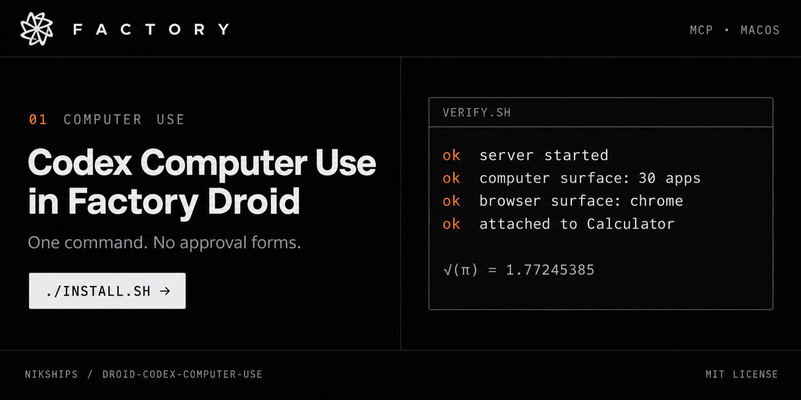

<div align="center">



# droid-codex-computer-use

**Let Factory Droid control your Mac with the Computer Use tool from the Codex app.**<br/>
One command to install. No approval forms. No hand-edited paths.

[](https://github.com/nikships/droid-codex-computer-use/stargazers)
[](LICENSE)
[](#requirements)
[](https://github.com/nikships/droid-codex-computer-use/commits/main)

[Quick Start](#quick-start) · [How it works](docs/how-it-works.md) · [Security](#security) · [Troubleshooting](#troubleshooting)

</div>

## What is this?

The Codex desktop app includes a Computer Use MCP server that can read and control macOS apps and Chrome. You can point Factory Droid at the same server, but every call fails with this error:

```
nodeRepl.createElicitation is unavailable because the MCP client does not support form elicitation
```

This repo installs a small launcher between Droid and the Codex server that fixes that error. It finds the Codex app on your machine, so you don't need to edit any paths by hand.

## Requirements

- macOS on Apple silicon or Intel.
- The Codex desktop app, installed anywhere (it's usually `/Applications/ChatGPT.app` or `/Applications/Codex.app`).
- Computer Use turned on in the Codex app at least once, with its macOS permissions granted. Codex installs a helper app at `~/.codex/computer-use/Codex Computer Use.app` and asks for Accessibility and Screen Recording access. Droid uses the same helper.
- Factory Droid (the CLI or the Factory App).

You don't need your own Node.js. The scripts use the Node runtime that ships inside the Codex app.

## Quick Start

```sh
git clone https://github.com/nikships/droid-codex-computer-use.git
cd droid-codex-computer-use
./install.sh
./verify.sh --app Calculator
```

`install.sh` writes a `computer-use` server to `~/.factory/mcp.json`, after backing up the existing file. Droid reloads that file automatically, so the tools show up in your current session. If they don't, run `/mcp` in Droid or start a new session.

`verify.sh` starts the server the same way Droid does. It then lists what Computer Use can see and attaches to Calculator. A good run looks like this:

```
ok  server started and initialized
ok  tools: js, js_add_node_module_dir, js_reset, turn_ended
ok  computer surface: 30 apps visible
ok  browser surface: 1 browser(s) visible
ok  attached to Calculator without an approval prompt

Computer Use is ready for Droid.
```

Then try it in Droid:

> Use computer use to open the Calculator app and calculate the square root of pi.

Droid opens Calculator, switches to Scientific mode, and shows `√(π) = 1.77245385`.

> [!TIP]
> If this saved you some digging, [star the repo](https://github.com/nikships/droid-codex-computer-use/stargazers) so other Droid users can find it.

## What gets installed

| Path | Purpose |
|------|---------|
| `~/.factory/codex-computer-use/launcher.mjs` | The MCP launcher Droid starts. |
| `~/.factory/codex-computer-use/codex.mjs` | Finds the Codex app and its server definition. |
| `~/.factory/mcp.json` | Gets a `computer-use` entry. A timestamped backup is made first. |

The `mcp.json` entry looks like this, with your own paths filled in:

```json
{
  "computer-use": {
    "type": "stdio",
    "command": "/Applications/ChatGPT.app/Contents/Resources/cua_node/bin/node",
    "args": ["/Users/you/.factory/codex-computer-use/launcher.mjs"],
    "env": {
      "CODEX_APP_PATH": "/Applications/ChatGPT.app",
      "CODEX_HOME": "/Users/you/.codex"
    },
    "connectTimeout": 120000,
    "timeout": 600000
  }
}
```

Run `./install.sh --print` to see the exact entry for your machine without changing anything.

## Options

```sh
./install.sh --dry-run                    # show what would change
./install.sh --name codex-cu              # use a different server name
./install.sh --codex-app /path/To.app     # skip auto-detection
./install.sh --codex-home ~/.codex-work   # non-default Codex data directory
./install.sh --factory-dir ~/.factory     # non-default Factory config directory
./install.sh --force                      # replace an existing entry this tool didn't create
```

`CODEX_APP_PATH`, `CODEX_HOME`, and `FACTORY_HOME` work in place of the matching flags. `verify.sh` and `uninstall.sh` accept `--name` and `--factory-dir` too.

If you already set up a `computer-use` server by hand, the installer stops rather than overwrite it. Re-run with `--force` to replace it. Your old file is still backed up first.

## How it works

The launcher fixes two gaps between Droid and the Codex server. See [docs/how-it-works.md](docs/how-it-works.md) for the details.

1. **Approval forms.** Before it controls an app, the server asks for approval through MCP form elicitation. Droid doesn't support form elicitation, so the server fails. The launcher tells the server that forms are supported, then answers every approval request with "accept, always". Approved apps are saved to the same list the Codex app uses.
2. **Codex turn metadata.** The browser surface expects each tool call to carry `x-codex-turn-metadata`, which only Codex sends. The launcher adds a session ID and turn ID to every call, and starts a new turn after `turn_ended`.

The launcher reads the server definition each time it starts. It prefers the one the Codex app writes to `~/.codex/plugins/cache/*/unified-computer-use/<version>/.mcp.json`, so Codex app updates take effect without reinstalling. If that file doesn't exist yet, the launcher builds the same definition from the app bundle.

## Security

- **Every approval prompt from this server is accepted automatically.** That includes using any app, recording computer audio, and running JavaScript in the server's REPL. Install this only if you want Droid to control your Mac without asking first.
- Apps that Codex blocks outright, by organization policy or for safety reasons, stay blocked. Those blocks aren't approval prompts.
- Droid's own tool permission checks still apply, based on your Droid autonomy level.
- Saved app approvals live in `~/Library/Group Containers/2DC432GLL2.com.openai.sky.CUAService/Library/Application Support/Software/ComputerUseAppApprovals.json`. The Codex app shares this file. Delete it to clear every saved app approval.

## Troubleshooting

| Symptom | Fix |
|---------|-----|
| `Could not find the Codex desktop app` | Install the Codex app, or pass `--codex-app /path/to/App.app`. |
| `This Codex app build does not include the computer-use runtime` | Update the Codex app. |
| Warning that `Codex Computer Use.app` wasn't found | Open the Codex app, turn on Computer Use, and grant its permissions once. |
| `verify.sh` shows a browser surface warning | Computer Use for desktop apps still works. Browser control needs Chrome and the Codex Chrome extension from the Codex app. |
| Tools don't appear in Droid | Run `/mcp` in Droid to see the server's status, or start a new session. |
| Clicks or screenshots fail | Check System Settings > Privacy & Security, under Accessibility and Screen Recording, for `Codex Computer Use`. |

## Uninstall

```sh
./uninstall.sh
```

This removes the `computer-use` entry from `~/.factory/mcp.json`, after a backup, and deletes `~/.factory/codex-computer-use/`. It leaves the shared app-approval file in place.

## Project Structure

```
droid-codex-computer-use/
├── assets/
│   └── banner.png
├── docs/
│   └── how-it-works.md   # protocol details and design notes
├── runtime/
│   ├── codex.mjs         # finds the Codex app and the server definition
│   └── launcher.mjs      # the MCP launcher Droid starts
├── scripts/
│   ├── common.mjs        # shared helpers for the setup scripts
│   ├── install.mjs
│   ├── run-node.sh       # runs scripts with Node from the Codex app
│   ├── uninstall.mjs
│   └── verify.mjs
├── install.sh
├── LICENSE
├── README.md
├── uninstall.sh
└── verify.sh
```

## License

[MIT](LICENSE). This project is not affiliated with OpenAI or Factory. It uses the Codex app's Computer Use runtime as installed on your machine and does not redistribute it.

## Star History

<div align="center">

<a href="https://star-history.com/#nikships/droid-codex-computer-use&Date">
  <picture>
    <source media="(prefers-color-scheme: dark)" srcset="https://api.star-history.com/svg?repos=nikships/droid-codex-computer-use&type=Date&theme=dark" />
    <source media="(prefers-color-scheme: light)" srcset="https://api.star-history.com/svg?repos=nikships/droid-codex-computer-use&type=Date" />
    
  </picture>
</a>

## Stargazers

<a href="https://github.com/nikships/droid-codex-computer-use/stargazers">
  <picture>
    <source media="(prefers-color-scheme: dark)" srcset="https://bytecrank.com/nastyox/reporoster/php/stargazersSVG.php?theme=dark&user=nikships&repo=droid-codex-computer-use" />
    <source media="(prefers-color-scheme: light)" srcset="https://bytecrank.com/nastyox/reporoster/php/stargazersSVG.php?user=nikships&repo=droid-codex-computer-use" />
    
  </picture>
</a>

</div>
