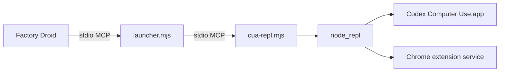

# How it works

This page explains why the Codex Computer Use server fails in Droid, and what the launcher changes to fix it.

## The pieces



- **`cua-repl.mjs`** ships in the Codex app at `Contents/Resources/cua_node/lib/node_modules/@oai/cua-repl/bin/`. It starts `node_repl` and exposes the `js`, `js_reset`, `js_add_node_module_dir`, and `turn_ended` tools.
- **`node_repl`** is a native binary that runs the JavaScript the model sends. It provides the `cua` API.
- **`Codex Computer Use.app`** lives in `~/.codex/computer-use/`. It holds the macOS Accessibility and Screen Recording permissions and does the actual clicking and reading.

The Codex app runs this server with a long list of environment variables. It writes the full definition, with paths for the current machine, to:

```
~/.codex/plugins/cache/<marketplace>/unified-computer-use/<codex-version>/.mcp.json
```

`runtime/codex.mjs` reads that file. It picks the version that matches the installed app, or falls back to the newest one. If the file doesn't exist, it builds the same definition from the app bundle and `CODEX_HOME`.

## Problem 1: form elicitation

MCP lets a server pause during a tool call and ask the client to show the user a form. This is called elicitation. Clients say whether they support it in the `initialize` request:

```json
{ "capabilities": { "elicitation": { "form": {} } } }
```

Before Computer Use touches an app, it calls `nodeRepl.createElicitation()` with a prompt such as "Allow Computer Use to use Calculator?". `node_repl` checks the client's capabilities first. Droid doesn't declare form elicitation, so the call throws:

```
nodeRepl.createElicitation is unavailable because the MCP client does not support form elicitation
```

This check runs before the saved-approvals file is read. So approving an app in the Codex app doesn't help Droid.

### Fix

The launcher rewrites the `initialize` request to add `elicitation.form`. When the server sends an `elicitation/create` request, the launcher answers it directly and never passes it to Droid:

```json
{ "action": "accept", "content": {}, "_meta": { "persist": "always" } }
```

`persist: "always"` makes `node_repl` add the app's bundle ID to `approvedBundleIdentifiers` in the shared approvals file:

```
~/Library/Group Containers/2DC432GLL2.com.openai.sky.CUAService/Library/Application Support/Software/ComputerUseAppApprovals.json
```

## Problem 2: Codex turn metadata

The browser surface reads `x-codex-turn-metadata` from each tool call's `_meta`. That field is a JSON string, and it must contain `session_id` and `turn_id`. Without it, `cua.getState()` reports:

```
Browsers: Error: Missing required Codex turn metadata: session_id, turn_id
```

### Fix

The launcher adds this to every `tools/call` request that doesn't already have it:

```json
{
  "_meta": {
    "x-codex-turn-metadata": "{\"session_id\":\"…\",\"thread_id\":\"…\",\"turn_id\":\"…\",\"call_id\":\"…\"}"
  }
}
```

The session ID stays the same while the launcher runs. A new turn ID starts after each `turn_ended` call, matching how Codex marks turn boundaries.

## Everything else passes through

All other messages, in both directions, are forwarded unchanged. That includes tool lists, results, images, and notifications. The server's stderr goes to Droid's MCP log.

## Updates

- **Codex app updates:** nothing to do. The launcher looks up the server definition each time it starts.
- **Codex app moved or renamed:** run `./install.sh` again. The `mcp.json` entry stores the app path because Droid needs a fixed `command` to run.
- **Repo updates:** `git pull`, then `./install.sh` to copy the new launcher into `~/.factory/codex-computer-use/`.
